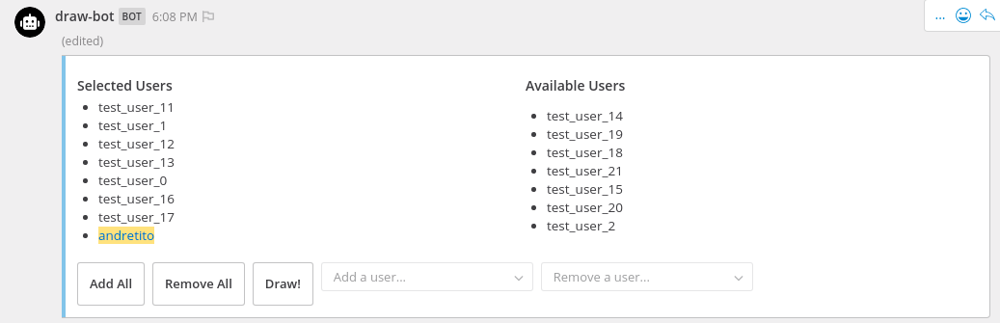
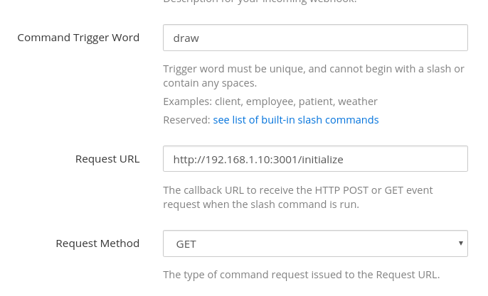
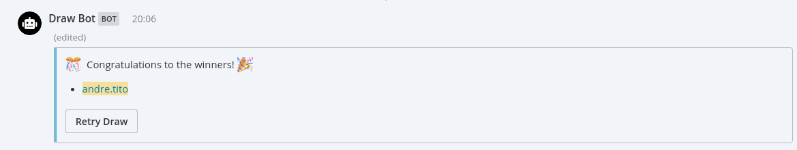

# Draw Bot
Draw bot is a lottery system built for Mattermost that enables users to randomly select a few lucky users to win prizes (or do coffee runs! :coffee:)



Things to note:
* This bot is not recommended for use in channels that are larger than 30+ people. There is no hard limit set and the bot WILL print every user in the channel as a list, you've been warned!
* A MongoDB instance is required for this in order to persist data, and allow users to re-run past draws. The bot is currently just using the default `admin` table provided by MongoDB, but further configuration to use a different table has been planned

## Running on Docker
0. Build Drawbot image
```
docker build -t draw-bot .
```

1. Run mongodb (from container)
```
docker run -d -p 27017:27017 -e MONGO_INITDB_ROOT_USERNAME="root" -e MONGO_INITDB_ROOT_PASSWORD="test_passwd" --name draw-mongo mongo:latest
```

2. [Create a Bot Account](https://docs.mattermost.com/developer/bot-accounts.html#user-interface-ui), or [issue a Personal Access Token](https://docs.mattermost.com/developer/personal-access-tokens.html#creating-a-personal-access-token) from Mattermost

3. Run Drawbot container  
Ensure you have the following environment variables set when running the container:

| Variable name | Example value | Explanations / Notes |
| :--: | :--: | :-- |
| PORT | 3001 | The port being used by this chatbot |
| MATTERMOST_SERVER | http://192.168.1.10:8065 | The Mattermost instance you are using |
| TOKEN | sd67j1cxepnc7meo3pof3krzgr | A Personal Access Token or Bot Account Token |
| MONGO_USERNAME | root | Auth username for a mongodb server |
| MONGO_PASSWORD | test_passwd | Auth password for a mongodb server |
| MONGO_SERVER | 192.168.1.10:27017 | The endpoint for a mongodb server |
| CHATBOT_SERVER | http://192.168.1.10:3001 | IP to be used by this chatbot (needed to set URL endpoints in Message Attachments) |
| TZ | Asia/Seoul | A timezone that will be used for timestamps when logging |

Example `run` command:
```
docker run -d -p 3001:3001 -v $PWD:/home/app -e TZ="Asia/Seoul" -e PORT=3001 -e MATTERMOST_SERVER="https://192.168.1.10:8065" -e TOKEN="sd67j1cxepnc7meo3prf3krzgr" -e MONGO_USERNAME="root" -e MONGO_PASSWORD="test_passwd" -e MONGO_SERVER="192.168.1.10:27017" -e CHATBOT_SERVER="http://192.168.1.10:3001" --name draw-bot draw-bot
```

4. [Register a slash command](https://docs.mattermost.com/developer/slash-commands.html#custom-slash-command) in Mattermost that sends a `GET` request to the `/initialize` endpoint



5. Run the `draw` command (or whatever trigger word you've set) and have fun!

